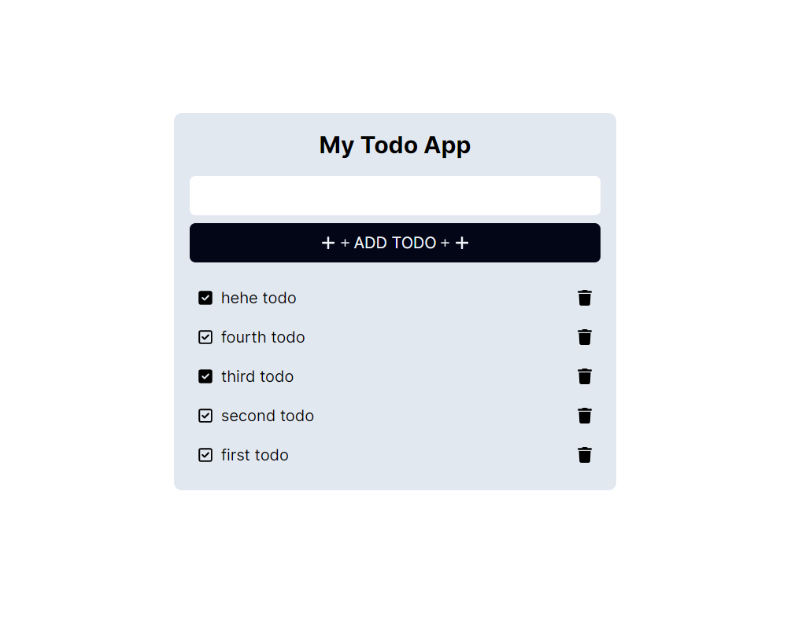

<h1 align="center">Todo-App</h1>

## Overview
To be honest this is a simple todo app to get comfortable with Nextjs and Java, In buidling this I learnt how to make an API in Java and how to use NextJs (react with ts :D). 

### Screenshot

### Built with

- [NextJs](https://nextjs.org/) 
- [Java](https://www.java.com/en/)
- [Spring (Building a RESTful Web Service )](https://spring.io/guides/gs/rest-service/)
- [Tailwindcss](https://tailwindcss.com/) 

## Contributing

Feel free to contribute. There is a very high probablity that you'll find a bug here LOL.
